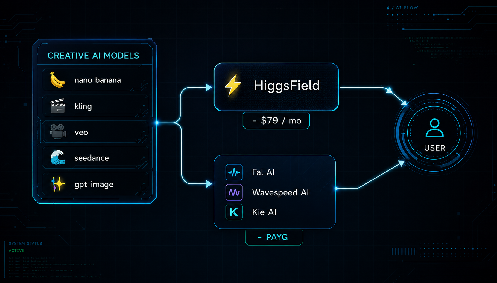

# generator-skill

**🇧🇷 [Português](README.md) · 🇺🇸 [English](README.en.md) · 🇪🇸 [Español](README.es.md)**


## 📖 Usage guide

Complete guide (landing page + step-by-step instructions): **https://inematds.github.io/generator-skill/guia/en/**

Two versions of the `/generate` skill — one command for the agent to generate images and
videos on demand, choose the lowest-cost route, control spending, and save
everything in one place.

There are two because the skill’s most important decision — **which route is
cheapest** — has opposite answers depending on the machine.

## Which one to use

| | [`generate-local/`](generate-local/) | [`generate-api/`](generate-api/) |
|---|---|---|
| **For** | a machine running a model locally | any machine, everything via API |
| **Cheapest route** | local, **$0** (flux2-klein on the GPU) | a low-cost paid model, ~$0.02 |
| **Billing model** | hardware already paid for, zero marginal cost | pay-as-you-go per call |
| **Paid route** | exception — only two reasons | the only option |
| **Default image** | local flux2-klein, ~6 s | low-cost image model |
| **Image with legible text** | fal.ai, paid (local gets letters wrong) | top model, paid |
| **Default video** | local 2.5D render (`pixflow-motion`), $0 | generative model, $0.20–0.35/s |
| **Cost gate** | exists, almost never triggers | triggers on every run |
| **“Draft cheap, finish expensive”** | makes no sense — it’s the same model | the rule that saves the most |
| **Ledger** | exists, almost always empty | the heart of the skill |
| **Depends on** | `inemaimg` server running (port 8000) | `FAL_KEY` + `KIE_API_KEY` in a `.env` |
| **Warning threshold** | $20/month | configurable, default $50/month |

What **doesn’t** change between the two, because it’s what makes the system
last: a Markdown recipe for each model, a flat library, a JSON log alongside
each file, real references instead of descriptions, and the rules inside
`SKILL.md` — which the agent rereads each time it’s used.

## The five steps

The workflow is the same in both versions; only the destination of step 1 changes.

1. **Route to the most cost-effective model** that can handle the task, and read
   that model’s recipe before calling it.
2. **Use real references** — logos, faces, style — loaded from `refs/`.
   Describing a logo in words gives you the wrong logo every time.
3. **Generate** an image or video. If the model is asynchronous, check its status and
   download it right away, because result URLs expire.
4. **Save everything in one flat folder**, with no subfolders and a predictable name.
5. **Record the prompt, model, parameters, and cost** in a JSON file alongside the asset.

## Why an aggregator, and why pay-as-you-go



The same models are accessible through routes with very different billing
structures. **Subscription** platforms charge a fixed monthly amount — predictable, and a good fit
when usage is high and consistent. **Pay-as-you-go** aggregators (fal.ai, Kie AI)
charge per call, with one key and one bill for dozens of models.

The `generate-api` version assumes pay-as-you-go, for three reasons: it starts at zero,
costs can be attributed to each generation (which powers the ledger), and you
don’t pay a monthly fee during idle months. If volume increases to the point
where a subscription is cheaper, the calculation is simple — add up the month in
`--saldo` and compare.

With the `generate-local` version, there’s no debate: the GPU is already paid for, and the paid route
only comes in for the two documented exceptions.

## Install

```bash
cp -r generate-local ~/.claude/skills/generate               # machine with GPU
cp -r generate-api  <workspace>/.claude/skills/generate      # machine without a local model
```

Both declare `name: generate`. Install **one** per workspace, or rename it.

## Documentation

- [`generate-local/README.md`](generate-local/README.md) and
  [`generate-api/README.md`](generate-api/README.md) — each version in detail.
- [`doc/guia-skill-generate-ptbr.md`](doc/guia-skill-generate-ptbr.md) — translated
  technical guide: provider authentication, asynchronous pattern, model table,
  cost ranges.
- [`doc/analise-generate-skill-guide.md`](doc/analise-generate-skill-guide.md) —
  analysis of the original material: what it gets right and what was missing
  (cumulative budget, versioned pricing, resuming asynchronous jobs — all three are
  implemented here).

## A note that applies to both

Model IDs, prices, and endpoints change frequently. Anything that hasn’t been
confirmed with a real call is marked **NOT VERIFIED** in the recipes.
Check the provider’s current documentation before relying on it.
